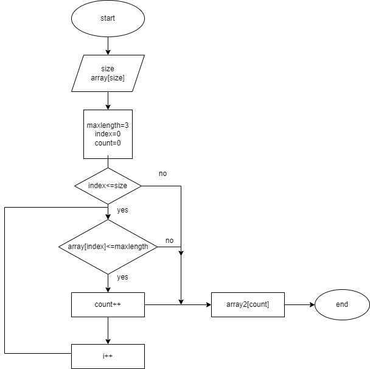

1. начало
2. пользователь вводит с клавиатуры размер массива (кол-во элементов) и сами элементы
3. задаем максимальный размер элемента = 3, задаем счетчик, задаем индекс начального элемента
4. проверяем первый элемент на условие, меньше или равно 3
5. если да - счетчик прибавляем, а этот элемент становится элементом нового массива
6. если нет - идем к следующему элементу и снова проверяем условие
7. когда элементы закончились - выводим новый массив с новыми элементами, удовлетворяющими условию

 